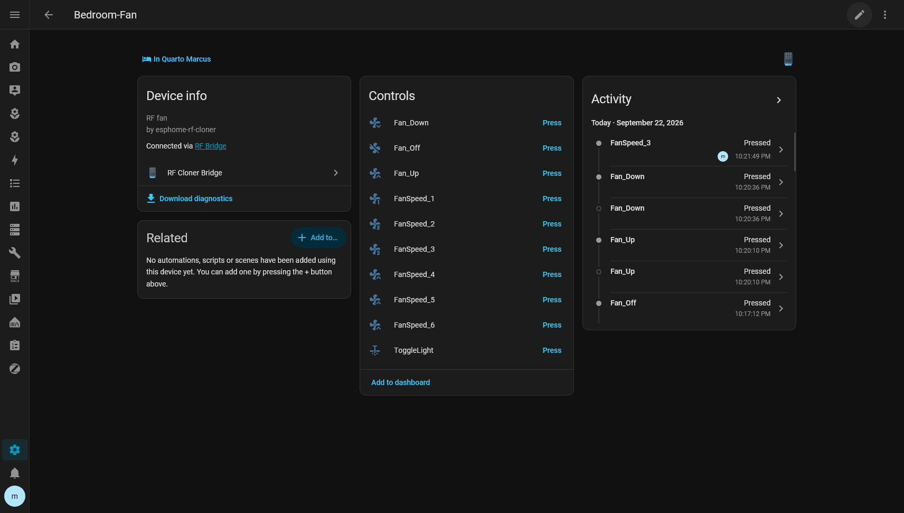
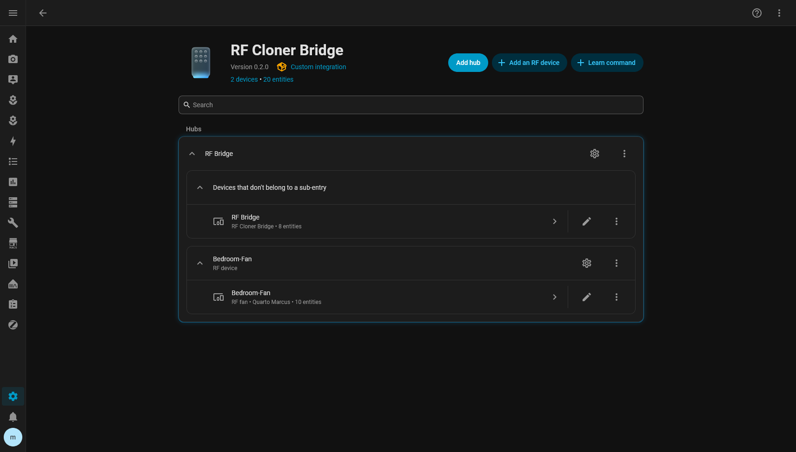
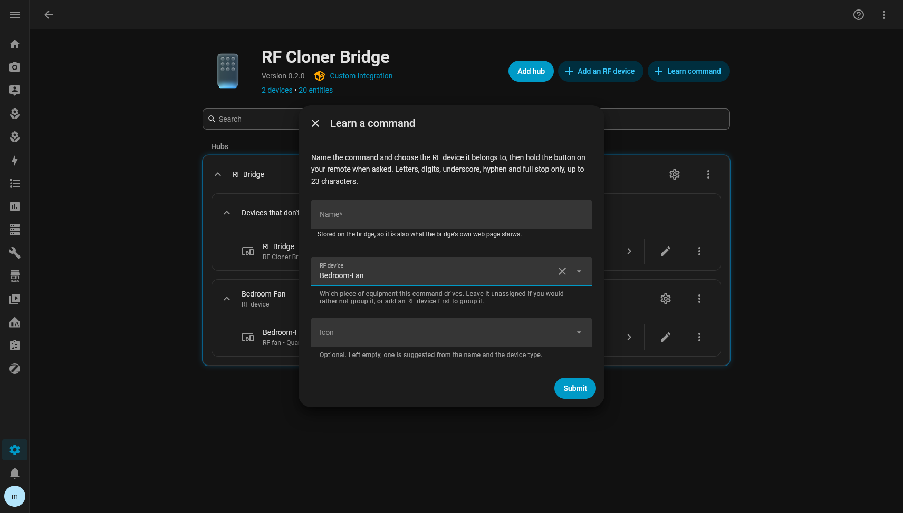

# RF Cloner

A learn-and-replay sub-GHz RF bridge for ESPHome and Home Assistant, built on an ESP32 and a
CC1101.

Point a remote at it, press a button, and that command becomes a Home Assistant button you can put
on a dashboard or call from an automation. No YAML editing, no recompile per command, no protocol
to identify. Learned commands live on the ESP32, so they survive reboots, firmware updates and a
Home Assistant outage.



> [!NOTE]
> Pre-release. The design is settled and validated on real hardware, but this has not yet been
> used by anyone other than its author. Expect rough edges, and read the
> [limitations](#limitations) before you build one.

---

## What problem it solves

Plenty of cheap devices — shutters, sockets, lights, gates, fans — ship with a sub-GHz remote and
no integration. The usual route is to identify the protocol, find or write a decoder, and encode
commands by hand.

RF Cloner skips that. It records the raw waveform of a button press, checks it against repeats of
itself, stores it under a name, and plays it back. It never needs to know what the protocol
*means*.

ESPHome already ships the CC1101 driver, raw capture and replay, and persistent storage. Home
Assistant ships a transmit-only RF entity domain. Neither ships RF *learning* or a store for
learned codes. That is the layer this adds: a named, persistent, on-device command registry with a
learn state machine, capture validation, and a Home Assistant management UI on top.

## What you need

- An **ESP32** with RMT — the original ESP32, S2, S3, C3, C6, H2 or P4.
- A **CC1101** module for your band. **It runs at 3.3 V and is not 5 V tolerant.**
- **ESPHome 2026.1** or newer.
- **Home Assistant 2026.8** or newer, if you want the integration. The bridge works without it.

Roughly the price of two coffees in parts. Wiring is in [docs/hardware.md](docs/hardware.md).

## What RF it is for

Tested and developed against **433.92 MHz ASK/OOK** fixed-code remotes.

The component itself is frequency-agnostic — it drives `remote_receiver` and `remote_transmitter`
and records the frequency with each command — so a CC1101 configured for 315, 868 or 915 MHz OOK
should work the same way. Those bands have not been tested here.

**It cannot control rolling-code devices.** If the transmission changes between presses — most
modern garage doors and car remotes — replay cannot work, no matter how it is implemented. That is
a property of the target, not a gap in this project.

## How learning works

1. You arm a capture with a name.
2. You hold the button on the original remote. Remotes repeat their frame while held.
3. Every captured window is validated: pulse count, pulse lengths, and agreement between repeats
   within a tolerance. A single noisy frame is discarded rather than stored.
4. Once enough repeats agree, the waveform is stored on the ESP32 along with its measured
   inter-frame gap, repeat count and frequency.

Replay sends the stored waveform, repeated with that gap. Nothing is decoded at any point.

## How Home Assistant fits in

The bridge is the authority. It owns the registry, the stored waveforms and the command
identities, and it replays autonomously. Home Assistant is the management UI and a restorable
replica.

- One **RF Cloner bridge device**, linked to the ESPHome node that carries it.
- One **button entity per learned command**. Press it to replay.
- **RF devices**: group a piece of equipment's commands under one Home Assistant device, with a
  type, an area and per-command icons. Grouping is Home Assistant-side only - moving a command
  between devices never relearns it, never touches its waveform and never changes its identity.
- **Learn a command** in the integration's own UI: type a name, pick the RF device it belongs to,
  press the remote when prompted.
- **Rename**, **re-icon**, **move** and **delete** through the same native UI. A rename keeps the
  command's identity, so entities, history and automations are unaffected.
- Diagnostic sensors for storage pressure, learn state and the last operation's result.
- An automatic **snapshot** of every command, waveforms included, kept in Home Assistant's own
  storage.

Everything is managed from the integration's own page — no YAML, no Developer Tools:



The integration talks to the node through Home Assistant's existing ESPHome connection. It opens
no second connection and needs no IP address, so the bridge can move around on DHCP freely.

## Does it work without Home Assistant?

Yes. Once a command is learned it lives on the ESP32:

- **Replay is autonomous.** ESPHome automations on the node can send commands with no network at
  all.
- **The bridge's own web page** carries a name field and learn, send and delete buttons, so it
  stays manageable while Home Assistant is down.
- Home Assistant is never consulted during a replay.

## What happens if the ESP dies

Home Assistant keeps a full replica — every command, with its waveform and its id — refreshed
whenever it reads a complete registry. To move to new hardware:

1. Flash the replacement with the same configuration.
2. **Reconfigure** the bridge in Home Assistant and point it at the new node.
3. It notices the node reports a different identity, and offers a restore.

Every command comes back under its original id, so existing entities, dashboards and automations
keep working. Commands can also be exported as portable JSON at any time, without Home Assistant,
through the bridge's own `rf_export` action.

A bridge reporting an identity Home Assistant does not expect never has its replica overwritten
and is never silently adopted. See
[docs/backup-and-replacement.md](docs/backup-and-replacement.md).

## Installation

Two halves, installed separately. Start with the bridge.

### 1. The ESPHome bridge

Wire the CC1101 ([docs/hardware.md](docs/hardware.md)), then flash
[`config/hardware-check.yaml`](config/hardware-check.yaml) to confirm the radio is detected and
your remote produces clean captures. It uses only upstream ESPHome components.

Then copy [`config/rf-bridge-remote.yaml`](config/rf-bridge-remote.yaml) into your ESPHome
directory. It pulls everything from this repository — nothing to clone:

```yaml
external_components:
  - source: github://codebyant/esphome-rf-cloner@main
    components: [rf_cloner]
```

Adjust the pins and the radio settings for your board, add `wifi_ssid`, `wifi_password` and
`api_key` to your ESPHome secrets, and flash.

### 2. The Home Assistant integration

Not in the HACS default store yet, so add this repository as a **custom repository**:

1. HACS, then the three-dot menu, then **Custom repositories**
2. URL `https://github.com/codebyant/esphome-rf-cloner`, type **Integration**
3. Install **RF Cloner Bridge**, then restart Home Assistant
4. **Settings → Devices & services → Add integration → RF Cloner Bridge**
5. Pick the ESPHome node running the bridge

Or copy `custom_components/rf_cloner/` into your Home Assistant `config/custom_components/` by
hand and restart.

Full walkthrough: [docs/installation.md](docs/installation.md).

### 3. Group and learn

1. On the integration page, **Add an RF device** for the equipment — *Bedroom Fan*, type *Fan*,
   area *Bedroom*.
2. **Learn command**. Name it, choose that RF device, submit.
3. Hold the button on the remote when the dialogue asks.



It appears straight away as a button on the RF device's page, ready for a dashboard or an
automation. Repeat for each button on the remote.

Step by step, with what to do when a learn fails: [Learn a new command](docs/guides/learn-a-command.md).

## Limitations

- **Rolling-code targets cannot be replayed.** Fundamental, not fixable here.
- **Only 433.92 MHz OOK has been tested.** Other OOK bands should work; nothing else is claimed.
- **Storage is bounded** by the ESP32's NVS partition — roughly 20 kB in ESPHome's default layout,
  which is tens of typical commands.
- **One frequency per component instance.** The frequency is recorded per command, but the radio
  is not retuned at replay time.
- **`remote_receiver`'s `idle:` has to be tuned** to sit between your remote's inter-frame gap and
  the pause between separate presses, for that gap to be measured directly rather than estimated.
- **Home Assistant reconciles by polling**, roughly every 30 seconds, plus an immediate refresh
  after any change it makes itself. A change made on the device's own web page takes up to that
  long to appear.
- Infrared is out of scope. Use ESPHome's own IR components.

## Documentation

### Guides

Step-by-step, with screenshots.

| | |
|---|---|
| [Learn a new command](docs/guides/learn-a-command.md) | Teach the bridge a remote button, relearn one that drifted |
| [Add an RF device](docs/guides/add-an-rf-device.md) | Group a piece of equipment's commands under one device |
| [Rename, move or delete a command](docs/guides/edit-move-or-delete-a-command.md) | Change a command after it is learned |
| [Use your commands](docs/guides/use-your-commands.md) | Dashboards, automations, scripts, on-device replay |

### Reference

| | |
|---|---|
| [Installation](docs/installation.md) | Both halves, start to finish |
| [Hardware](docs/hardware.md) | Wiring, supported parts, capture tuning |
| [Home Assistant](docs/home-assistant.md) | Entities, learning, renaming, deleting, actions |
| [Backup and replacement](docs/backup-and-replacement.md) | Snapshots, export, moving to new hardware |
| [Configuration](docs/configuration.md) | Every component option, action, trigger and entity |
| [Architecture](docs/architecture.md) | How it works and why it is built this way |
| [Troubleshooting](docs/troubleshooting.md) | When something does not behave |

## Development

```sh
sh tests/run.sh          # firmware logic, no ESPHome, no hardware
sh tests/run_python.sh   # integration logic, no Home Assistant
```

See [CONTRIBUTING.md](CONTRIBUTING.md).

## Licence

MIT. See [LICENSE](LICENSE).
