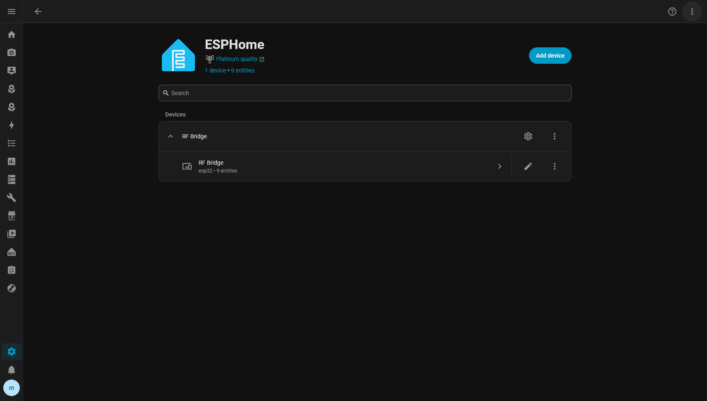
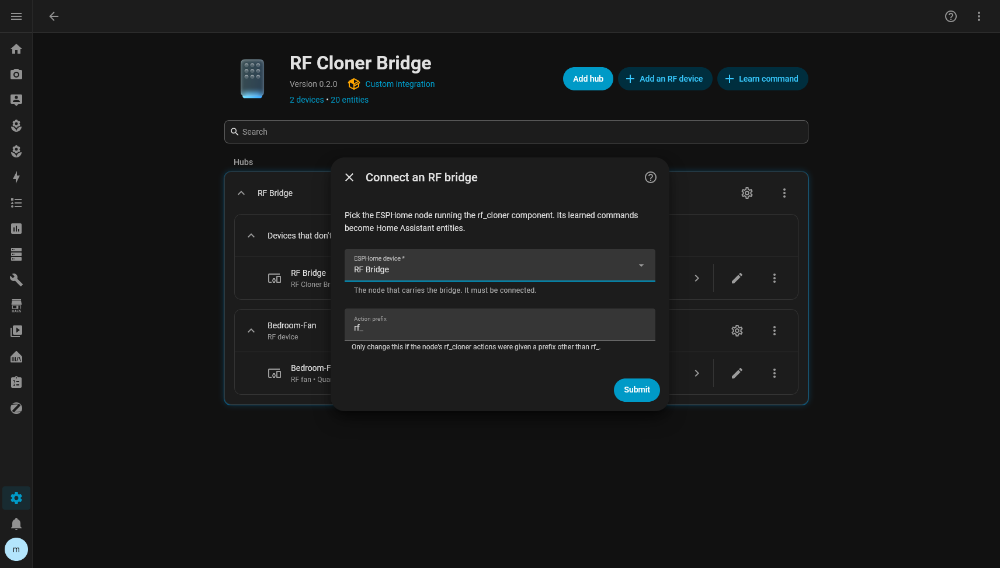
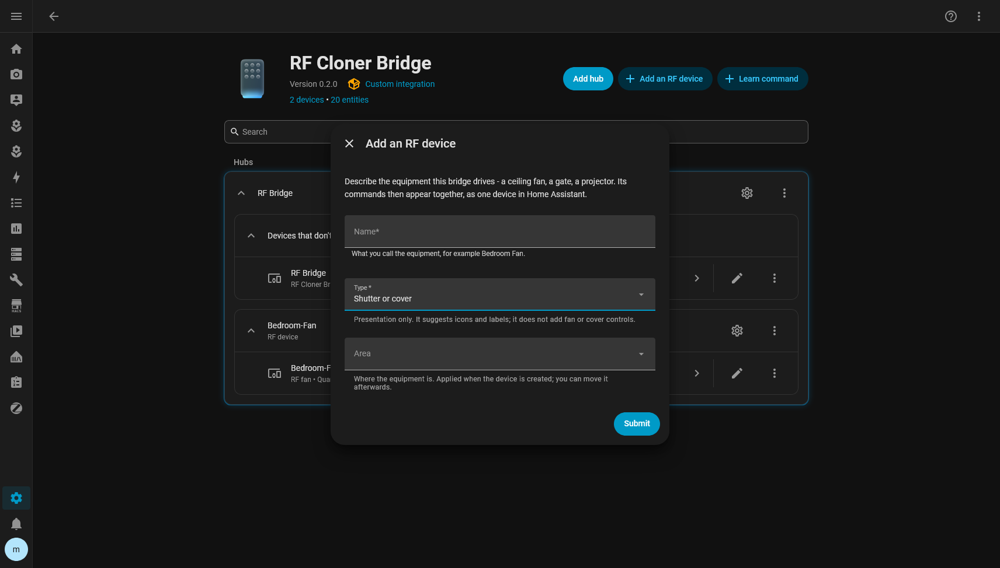

# Guides

Step-by-step tasks, with screenshots from a real install. For how things work and every option,
see the [reference documentation](../../README.md#documentation).

| Guide | You will |
|---|---|
| [Learn a new command](learn-a-command.md) | Teach the bridge one button from a remote and get a Home Assistant button for it |
| [Add an RF device](add-an-rf-device.md) | Group a piece of equipment's commands under one device, in one area |
| [Rename, move or delete a command](edit-move-or-delete-a-command.md) | Change a command after it is learned, safely |
| [Use your commands](use-your-commands.md) | Put commands on dashboards, in automations and in on-device ESPHome automations |

New install? Start with [installation.md](../installation.md), then come back to
[Add an RF device](add-an-rf-device.md) and [Learn a new command](learn-a-command.md), in that
order.

## The whole flow at a glance

```
Install bridge ─► Connect in HA ─► Add an RF device ─► Learn commands ─► Use them
 (ESPHome)       (Add integration)   (e.g. Bedroom Fan)  (hold the remote)   (dashboards,
                                                                               automations)
```

1. **The ESPHome node** runs the bridge and shows up under the ESPHome integration.

   

2. **Connect it** through *Add integration → RF Cloner Bridge*, picking that node.

   

3. **The integration page** is home base: the bridge, its RF devices, and the *Add an RF device*
   and *Learn command* buttons.

   

4. **Add an RF device** for each piece of equipment.

   

5. **Learn command**: name it, pick the RF device, hold the remote.

   

6. **Use it**: every command is a button on its RF device's page.

   
