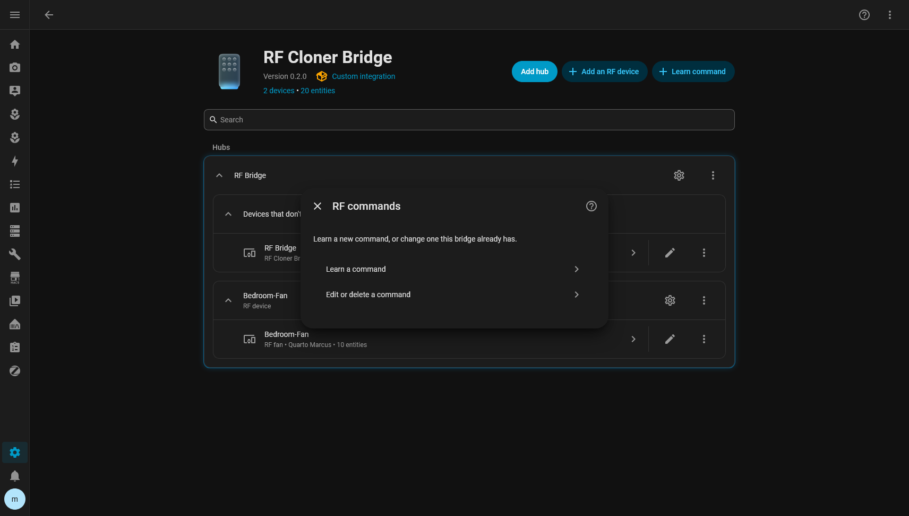
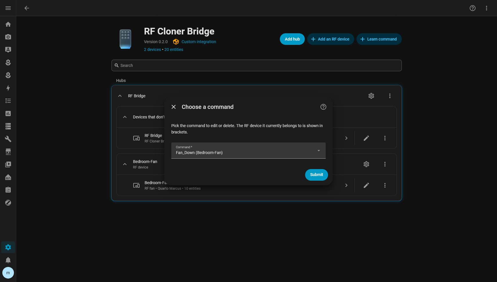
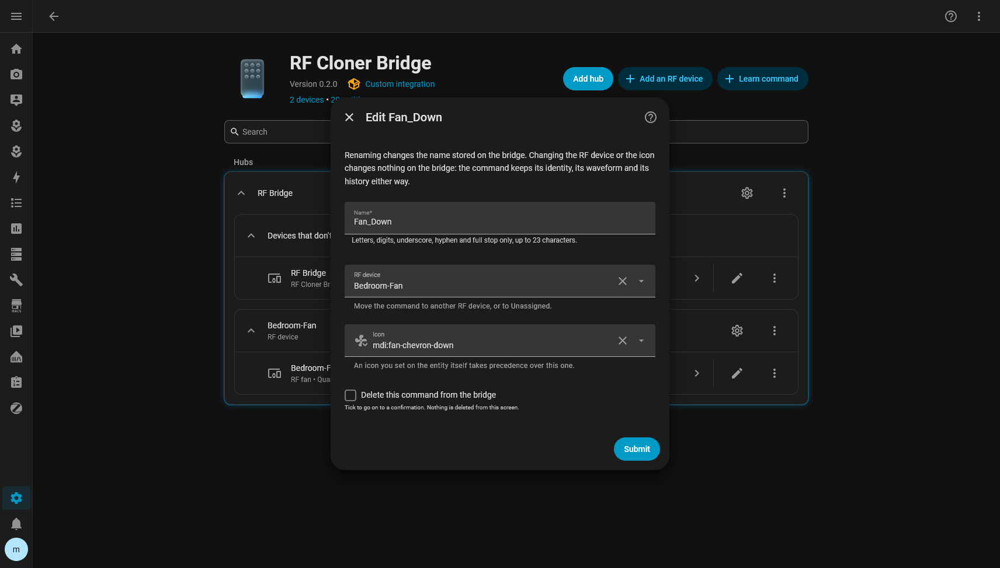

# Rename, move or delete a command

Everything you can change about a command after it is learned, from one screen.

| Change | Reaches the bridge? | Keeps entity id, history, automations? |
|---|---|---|
| Rename | Yes — the name is stored there | Yes |
| Move to another RF device | No | Yes |
| Change the icon | No | Yes |
| Delete | Yes — the waveform is erased | No, the button goes with it |

Commands are keyed by an immutable id, not by their name, which is why a rename is safe.

## Open the command editor

1. **Settings → Devices & services → RF Cloner Bridge**.
2. The **gear icon** on the bridge's row (the top-level hub, *RF Bridge* in the screenshots).
3. **Edit or delete a command**.

4. Pick the command. The RF device it belongs to right now is shown in brackets.

5. **Submit**, and the editor opens.

Change any combination of fields, then **Submit** once.

## Rename a command

Change **Name**. Same rules as when learning: letters, digits, `_`, `-` and `.`, up to 23
characters, and not already used on this bridge.

The new name is written to the bridge, so its own web page shows it too. The button's entity id
does **not** change, so dashboards and automations referring to it keep working. The displayed
name follows the new one unless you have overridden it in the entity's own settings.

If the bridge refuses — offline, or read-only — the dialogue says *The bridge refused the rename*
and nothing changes.

## Move a command to another RF device

Change **RF device**. Clear the field (the ✕) to make the command **Unassigned**.

Moving happens only in Home Assistant. The bridge is not contacted, nothing is relearned, and the
entity id, unique id, history and waveform stay exactly as they were. The button simply appears
under its new device.

To move many commands at once, repeat this per command — there is no bulk move yet.

## Change a command's icon

Pick an icon from **Icon**, or clear it to go back to the suggestion based on the name and the RF
device's type.

An icon set on the entity itself, through Home Assistant's own entity settings, always takes
precedence over this one, and the integration never overwrites it.

## Delete a command

> [!WARNING]
> Deleting erases the waveform from the bridge. It cannot be undone from Home Assistant; only a
> snapshot restore brings it back. If you might want it again, [export a snapshot](../backup-and-replacement.md)
> first, or just move it to **Unassigned** instead.

1. In the editor, tick **Delete this command from the bridge**. Ticking alone deletes nothing.
2. **Submit**.
3. A confirmation screen, *Delete Fan_Down?*, spells out what will go. Confirm.

The waveform is erased by id, and the button and its history are removed with it.

If the bridge refuses the delete, the command stays — or reappears on the next poll — rather than
vanishing from Home Assistant while still living on the bridge.

### Deleting a command vs deleting an RF device

Not the same thing:

- **Deleting a command** (above) erases a waveform from the bridge.
- **Deleting an RF device** only ungroups its commands; they stay on the bridge as Unassigned
  buttons. See [add-an-rf-device.md](add-an-rf-device.md#delete-an-rf-device).

## Changes made elsewhere

A rename or delete made on the bridge's own web page, or by an ESPHome automation, shows up in
Home Assistant within about 30 seconds.
