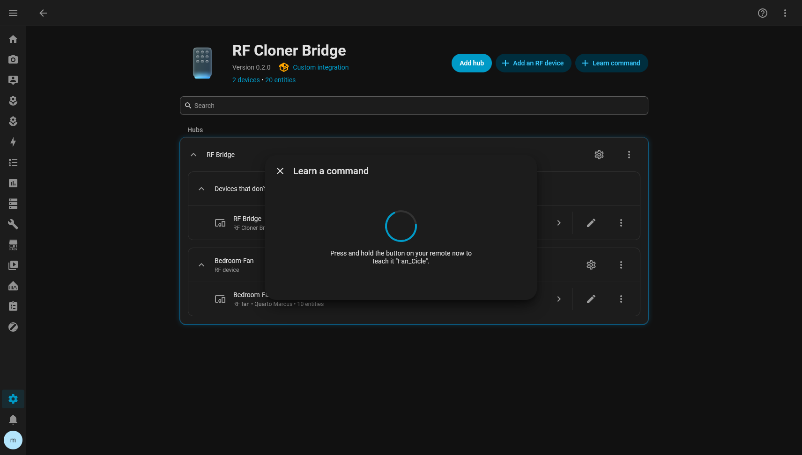

# Learn a new command

Teach the bridge one button from an existing remote, and get a Home Assistant button that replays
it.

**Before you start**

- The bridge is flashed and bound to Home Assistant — [installation.md](../installation.md).
- You have the original remote, with a working battery, within a metre or two of the bridge.
- Optional but tidy: the RF device the command belongs to already exists —
  [add-an-rf-device.md](add-an-rf-device.md). You can also leave the command unassigned and group
  it later.

Takes about a minute per command.

## 1. Open the learn form

**Settings → Devices & services → RF Cloner Bridge**, then **Learn command** at the top of the
page.


With more than one bridge set up, Home Assistant asks first which bridge should listen.

The same form is also reachable through the bridge's gear icon (**Configure**), then **Learn a
command**. Both entrances run the same code and produce the same record.

## 2. Name it and choose where it goes


| Field | What to put |
|---|---|
| **Name** | What the button does: `Fan_Up`, `Light_Toggle`, `Gate_Open`. Letters, digits, `_`, `-` and `.` only, up to 23 characters. The name is stored on the bridge, so its own web page shows it too |
| **RF device** | The equipment this command drives. Clear it to leave the command **Unassigned** |
| **Icon** | Optional. Left empty, one is suggested from the name and the RF device's type — `Fan_Down` on a fan gets a fan-with-down-chevron |

**Submit**.

> [!TIP]
> Name commands after what they *do*, not which button they are — `Speed_3`, not `Button_5`. The
> name becomes the button's label on every dashboard, and in the bridge's web page when Home
> Assistant is down.

## 3. Press and hold the remote button

The dialogue switches to a spinner. That means the bridge is armed and listening.



**Press the button on the remote and keep holding it** for a second or two, until the dialogue
closes.

Holding matters. Remotes repeat their frame for as long as the button is down, and the bridge only
accepts a capture once several repeats agree with each other. A quick tap often sends too few
repeats to validate.

## 4. Check the result

The dialogue closes with *Learned "Fan_Up" and assigned it to Bedroom-Fan.* The new button is
already on the RF device's page:


Press it once, with the equipment in view, to confirm the replay drives it. If it does, you are
done.

## If it did not work

The dialogue reports the bridge's own reason:

| Message | What to do |
|---|---|
| `timeout` | Nothing usable arrived. Move the remote closer, hold the button longer, check the band — [troubleshooting](../troubleshooting.md#learning-times-out) |
| `no_repeat_agreement` | Frames arrived but differed. Usually noise or a `filter:` that is too loose — [troubleshooting](../troubleshooting.md#learning-reports-no_repeat_agreement) |
| `too_many_pulses` | The frame is longer than `max_pulses`. Raise it in the bridge configuration |
| `store_full` / `budget_exceeded` | No room left. Delete commands you no longer use — [edit-move-or-delete-a-command.md](edit-move-or-delete-a-command.md) |
| *This bridge already has a command with that name* | Pick another name, or relearn the existing one (below) |
| *The bridge is not accepting changes right now* | The bridge is read-only or offline — [troubleshooting](../troubleshooting.md#the-device-booted-read-only) |

A failed learn writes nothing, so trying again is always safe.

**Learned, but pressing it does nothing?** The capture validated, so the waveform is consistent —
the replay is what needs attention. See
[troubleshooting](../troubleshooting.md#the-command-is-learned-but-does-not-drive-the-device).

**Changed your mind mid-learn?** Press **Cancel learning** on the bridge's device page. Left
alone, the capture also gives up by itself when the learn window closes, with `timeout`.

## Relearning a command that has drifted

Learning under a name that already exists **overwrites** that command's waveform and keeps its id,
so the button, its history and every automation using it stay as they are. That is the intended
way to replace a capture that has stopped working.

The integration's form refuses a duplicate name to stop accidents, so relearn through the action
instead:

```yaml
action: rf_cloner.learn
data:
  config_entry_id: <the bridge>
  name: Fan_Up
```

Run it from **Developer tools → Actions**, then hold the remote button.

## Learning a whole remote

Work down the remote one button at a time, repeating steps 1–4. Keep the RF device selected each
time — the form does not remember it between runs.

A fan remote with six speeds, up, down, off and a light is ten commands and about ten minutes.

## Learning without Home Assistant

The bridge's own web page (`http://<bridge address>/`, when `packages/controls.yaml` is included)
has a **name** field and a **Learn** button. Type the name, press **Learn**, hold the remote.

Commands learned there appear in Home Assistant within about 30 seconds, **Unassigned**. Move them
onto an RF device afterwards.

## Next

- [Put the new button on a dashboard or in an automation](use-your-commands.md)
- [Rename, move or delete it](edit-move-or-delete-a-command.md)
