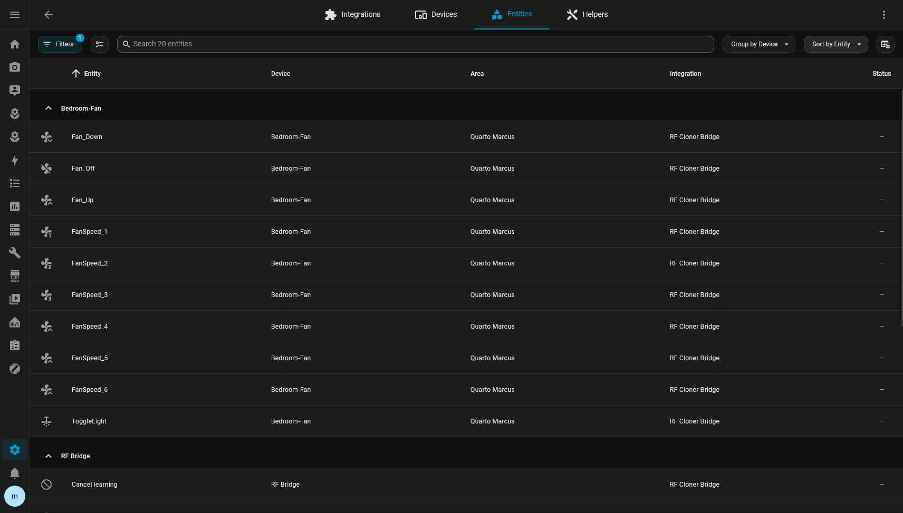

# Use your commands

Every learned command is an ordinary Home Assistant **button** entity. Anything that can press a
button can replay it: a dashboard, an automation, a script, a voice assistant, the bridge itself.

## Find the entity id

**Settings → Devices & services → Entities**, search for the command's name, or open the RF
device's page. The entity id is in the entity's settings, and looks like `button.fan_up`.



The entity id never changes when a command is renamed or moved, so it is safe to hard-code.

## On a dashboard

From the RF device's page, **Add to dashboard** under **Controls** adds every command of that
device in one go.


Or add a card by hand. A tile per command:

```yaml
type: tile
entity: button.fan_up
```

A compact remote, as a grid of buttons:

```yaml
type: grid
columns: 3
square: false
cards:
  - type: button
    entity: button.fan_down
    tap_action:
      action: perform-action
      perform_action: button.press
      target: { entity_id: button.fan_down }
  - type: button
    entity: button.fan_off
    tap_action:
      action: perform-action
      perform_action: button.press
      target: { entity_id: button.fan_off }
  - type: button
    entity: button.fan_up
    tap_action:
      action: perform-action
      perform_action: button.press
      target: { entity_id: button.fan_up }
```

## In an automation or script

Replaying is a `button.press`:

```yaml
action: button.press
target:
  entity_id: button.fan_off
```

Lower the shutters at sunset:

```yaml
automation:
  - alias: Shutters down at sunset
    triggers:
      - trigger: sun
        event: sunset
    actions:
      - action: button.press
        target:
          entity_id: button.living_room_shutter_down
```

Step a fan through several presses — give the equipment time between them:

```yaml
script:
  bedroom_fan_max:
    sequence:
      - action: button.press
        target: { entity_id: button.fan_up }
      - delay: { milliseconds: 500 }
      - action: button.press
        target: { entity_id: button.fan_up }
```

Target a whole RF device's commands by **device** or **area** only when you really mean *press all
of them* — it will.

## Knowing it was sent

A button's state is the time it was last pressed, and every press is in the RF device's
**Activity** log. That records that Home Assistant *sent* the command, not that the equipment
received it — RF remotes get no acknowledgement.

## On the bridge itself, with no network

Replay is autonomous on the ESP32. An ESPHome automation on the node can send a stored command by
name, with Home Assistant and Wi-Fi both down:

```yaml
binary_sensor:
  - platform: gpio
    pin: GPIO0
    name: "Wall switch"
    on_press:
      - rf_cloner.send:
          id: cloner
          name: Fan_Off
```

Use the name as it is stored on the bridge. Renaming the command later breaks this by-name
reference — update the YAML when you rename.

## Through the node's own actions

Bypassing the button entities, the node's ESPHome actions can be called like any other. They are named after the node, so a node
called `rf-bridge` exposes `esphome.rf_bridge_rf_send`:

```yaml
action: esphome.rf_bridge_rf_send
data:
  name: Fan_Off
```

`rf_send_id`, which takes the immutable `command_id`, survives renames. Both are listed in
[configuration.md](../configuration.md#packagesapi-actionsyaml).
